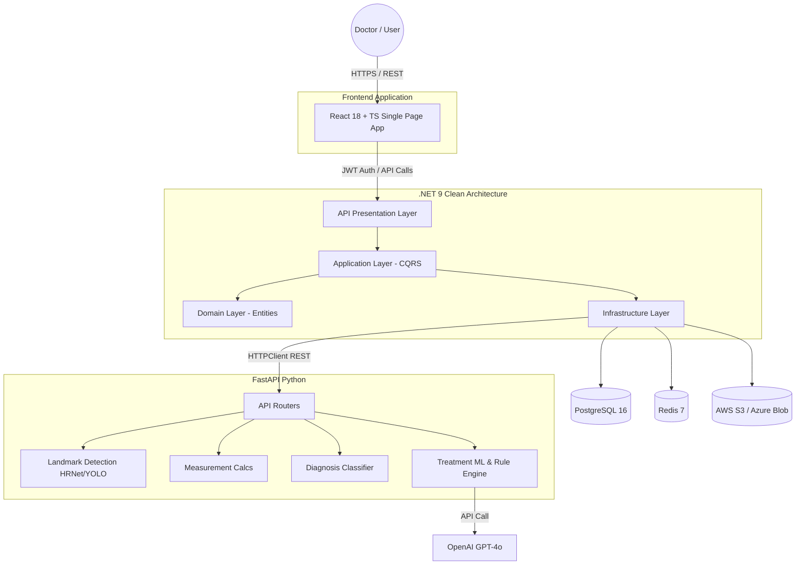
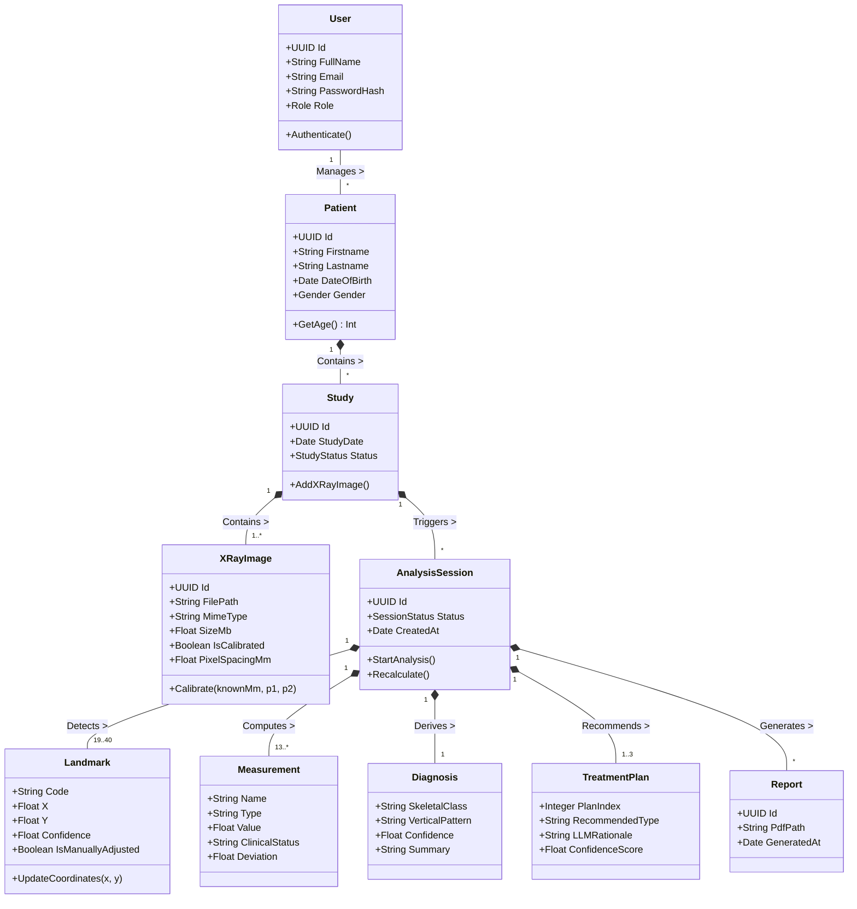
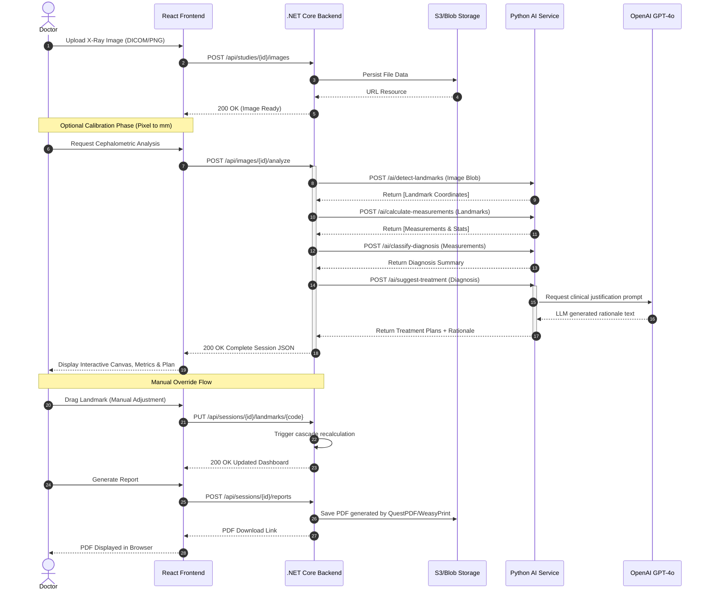
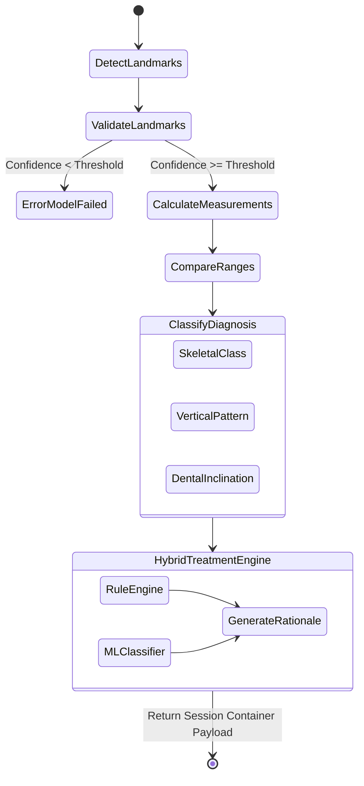

# AI Cephalometric Analysis — UML Diagrams

This document contains professional UML and architectural diagrams representing the core structure, entity relationships, and behavioral flows of the AI Cephalometric Analysis System. These models are based on the system's architecture and the requirements outlined in the implementation plan.

## 1. System Architecture Diagram

This component diagram visualizes the high-level architecture of the application, including the interaction between the React frontend, .NET Web API backend, Python AI microservice, and external components like PostgreSQL, Redis, Blob Storage, and the OpenAI LLM.

---

## 2. Domain Class Diagram (Entity Relationship)

This class diagram represents the DDD (Domain-Driven Design) core entities, their properties, and their cardinality. It models the core medical context including Patients, Studies, X-Rays, Sessions, and generated AI artifacts.

---

## 3. End-to-End Analysis Workflow (Sequence Diagram)

This sequence diagram depicts the chronological flow of messages between the Doctor, the UI, the monolithic Backend, the external Storage, and the AI Microservice during the core Analysis pipeline.

---

## 4. AI Service Activity Flow

This diagram outlines the internal logical flow executed by the Python FastAPI microservice when processing cephalometric data.

