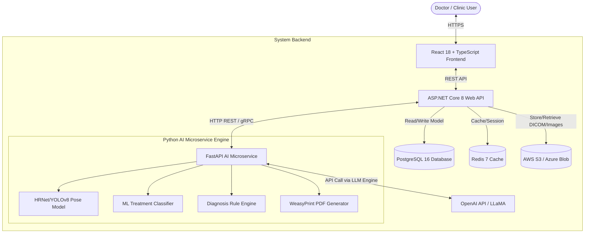
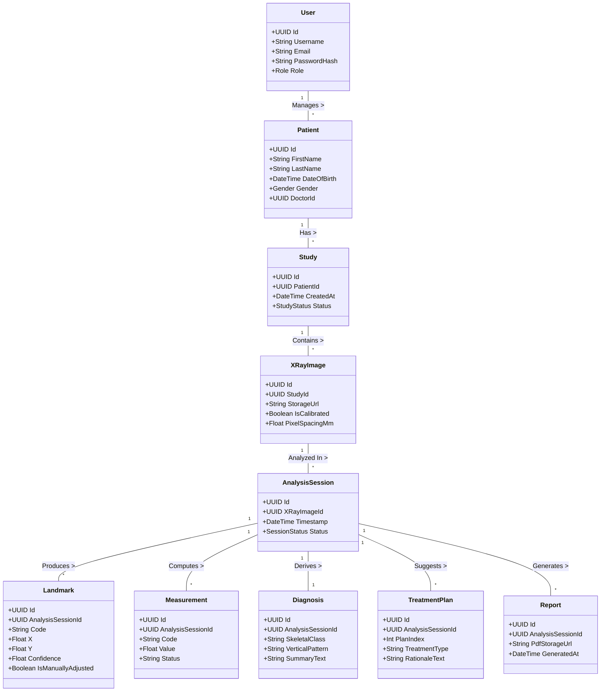
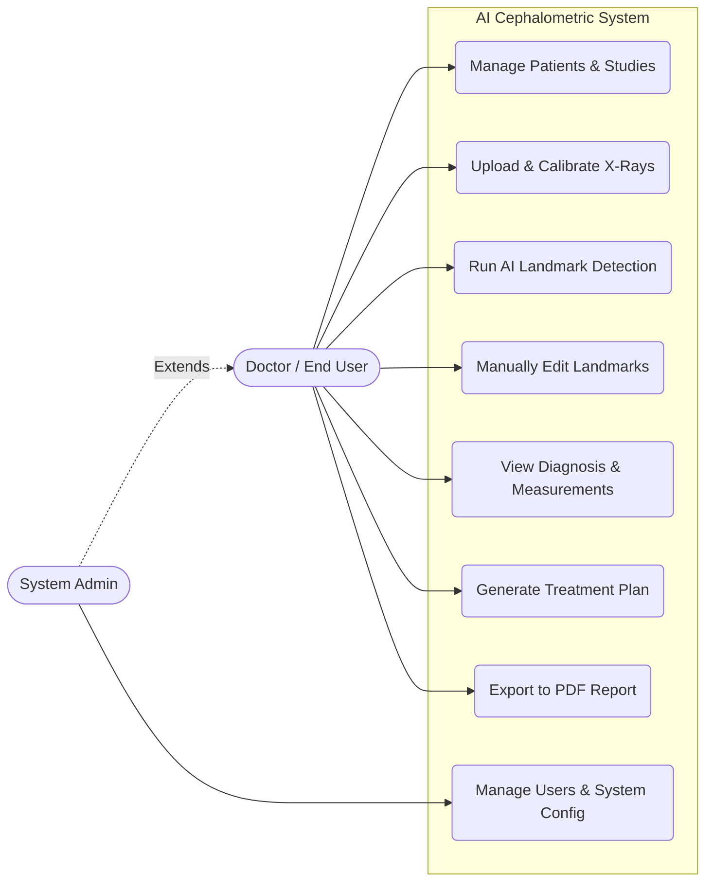
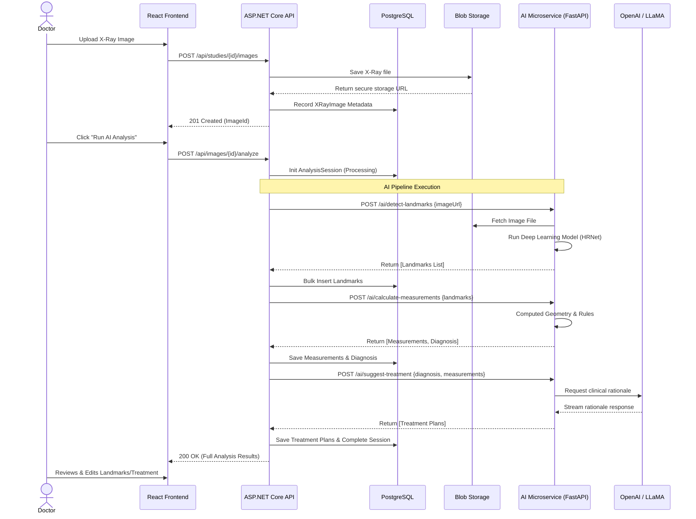
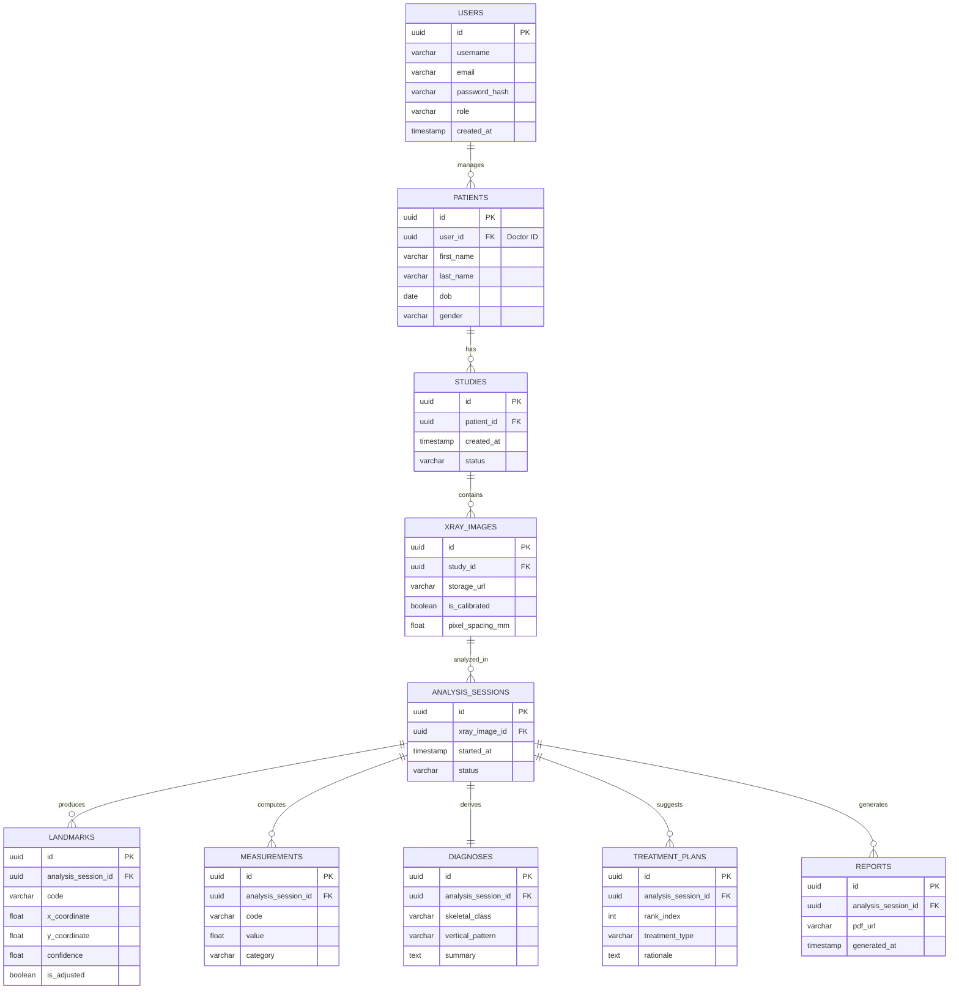

# AI Cephalometric Analysis System - UML Diagrams

This document contains professional technical diagrams detailing the system architecture, domain entities, use cases, and sequence flows for the AI-Based Cephalometric Analysis System.

## 1. System Architecture Diagram

This diagram outlines the microservices-based architecture, illustrating how the React frontend interacts with the ASP.NET Core API and the Python FastAPI AI microservice, along with external dependencies.

---

## 2. Domain Class Diagram

This class diagram represents the core entities in the Clean Architecture Domain layer and how they relate to one another within the system.

---

## 3. High-Level Use Case Diagram

This diagram visualizes the main interactions between the users (Doctors, Admins) and the core features of the system.

---

## 4. Sequence Diagram: Upload & Analysis Flow

This sequence diagrams walks through the critical path of uploading an X-Ray completely through to generating the AI-driven treatment plans and results. 

---

## 5. Entity-Relationship (ER) Diagram

This diagram visualizes the PostgreSQL database schema, highlighting primary and foreign keys, as well as one-to-many relationships across the system.

